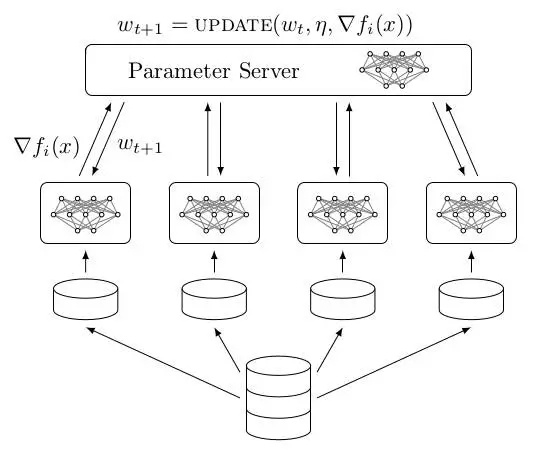

### 第二周操作

#### 目标

- [x] 测试jenkins的构建能力
- [x] 解决上周的遗留问题
- [x] 测试jenkins与Kubernetes结合的能力
- [ ] 测试Kubernetes对GPU资源的支持

### 上周遗留问题

1. 分布式训练的原理

   分布式训练策略有模型并行与数据并行之分，TF中一般采用数据并行，首先将数据集分割成n个块（shards）。每个单独的块将被分配给一个特定的worker。接下来，每个worker从其shards中采样mini-batches的数据用于训练一个local model。在一个（或多个）mini-batches之后，每个worker将与参数服务器通信，发送变量更新请求。这个更新请求一般都是梯度∇fi（x）。最后，参数服务器将所有这些参数更新的梯度收集起来，求平均（更新），并把更新之后的值发送到每个worker。。

   

   PS有各种更新方法（eg.**异步EASGD**）来达到训练目的

#### 第二周实验内容

测试了Jenkins的构建能力，用简单的demo体会一下构建流程。

利用Dockerfile和Jenkins的脚本完成了自动构建的流程。


#### 本周问题

1. Jenkins生成文件然后部署到Kubernetes之后，如何获取容器的输出？

   我觉得可以参考之前系统的设计

2. Jenkins的能力是否足够？

   在demo中，我只写几句简单的命令，而且并没有推送到仓库(推送到Dockerhub太慢了)

   ```shell
   docker build . -t test-python:1.0
   #generate kuberctl apply.yml
   docker run test-python:1.0 >result
   ```

   我们的系统会有更加复杂的构建流程吗，需要其他工具辅助吗？(Ansible, Helm等)

   如果只是简单的跑机器学习，看起来并没有复杂的构建需求，Jenkins的能力应该就够了

3. Jenkins在Kubernetes里还是在Kubernetes外？

   在外能避免容器内docker和kubectl的映射以及各种奇怪的缺库，少权限的情况。

   在内的话甚至能搭建Jenkins的集群，形成高可用的服务。

4. 关于如何处理学生使用第三方库的问题？

   因为我们没办法预知学生会不会用第三方库，所以Dockerfile中基镜像肯定是写`FROM tensorflow/tensorflow`，但是提交上来的任务可能用到第三方库。而Python不像Java那样maven打包就能搞定所有的依赖。

   关于这个问题我有两种想法：

   - 让学生自己写`Dockerfile`，我们提供基础的默认`Dockerfile`和一个`start.sh`。`Dockfile`的CMD后面写`bash start.sh`，如果没有用第三方库的话，`start.sh`里面只写一句运行py代码的命令。但是如果学生用了第三方库，学生就需要自己在`start.sh`前面加上安装依赖的语句(pip install之类的)

     这种做法有一定的风险，`pip install`要用root运行，但是如果用root运行容器，万一有人在start.sh里面写奇怪的东西，虽然我们可以通过commit记录把他揪出来锤一顿，但是毕竟还是有风险。

   - 利用`requirements.txt`，学生利用`pip freeze > requirements.txt`生成自己的requirements文件，然后在`Dockerfile`用到的`start.sh`文件开头加上`pip install -r requirements.txt`即可安装所有需要的依赖。

     这种做法的优点是`Dockerfile`和`start.sh`可以不用暴露出来，可以放在服务器上。

     但是我在测试的时候发现很容易安装依赖的时候出现Memory Error

   具体选择哪种方式，或者说其实还有其他更好的方式，可能还要研究讨论一下。

### Tip：

1. Dockerfile如果用到同一个版本的话，可以不用写在项目里面，用url的方式也可以执行
   `docker build github.com/creack/docker-firefox -t test:1.0`

2. 推送镜像到远程仓库的时候需要先打tag生成一个新的image
   `docker tag my-jenkins lianyoucat/my-jenkins`
   `docker push lianyoucat/my-jenkins`

3. 运行Jenkins的时候，因为Jenkins会用到宿主机的Docker，所以要做映射

   ```shell
   sudo docker run  --name my-jenkins \ 
   -p 11111:8080 -p 50000:50000 -u root -d \  
   -v /var/run/docker.sock:/var/run/docker.sock   \ 
   -v /usr/bin/docker:/usr/bin/docker  \ 
   -v /root/finalProject/jenkins:/var/jenkins_home  \
   -v /usr/lib64/libltdl.so.7:/usr/lib/x86_64-linux-gnu/libltdl.so.7 \
   lianyoucat/jenkins
   ```

   运行的时候复杂了不少，但是没办法，是要这么麻烦的。

4. Dockerfile的写法很大程度上会影响最后打包出来的镜像的大小，所以要注意Dockerfile的优化